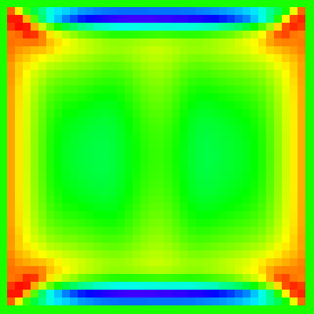

# número


> A friendly and intuitive math library for p5.js

[](#contributors)

[](https://app.travis-ci.com/nickmcintyre/numero)

This addon library for p5.js turns the "software sketchbook" into a beginner-friendly environment for technical computing. It provides the following features:

- A tensor object similar to [NumPy](https://numpy.org/) arrays
- A computer algebra system similar to [SymPy](https://www.sympy.org/en/index.html) (in progress)
- A grammar of graphics similar to [ggplot2](https://ggplot2.tidyverse.org/) (in progress)
- A grammar of data manipulation similar to [dplyr](https://dplyr.tidyverse.org/)
- A machine learning API similar to [scikit-learn](https://scikit-learn.org/stable/index.html) (coming soon!)
- A drawing turtle

The library is written in [TypeScript](http://www.typescriptlang.org/) and uses [Day.js](https://day.js.org/), [Math.js](https://mathjs.org/), [TensorFlow.js](https://js.tensorflow.org/api/latest/), and [tidy.js](https://pbeshai.github.io/tidy/) under the hood. It bundles [p5.tidy](https://github.com/nickmcintyre/p5.tidy), [TurtleGFX](https://github.com/CodeGuppyPrograms/TurtleGFX), and [wildflower](https://github.com/nickmcintyre/wildflower).

## Usage

### Plots
View the [plotting example](/examples/plotting/).
```javascript
let iris;
let plot;

function preload() {
  iris = loadTable('iris.csv', 'csv', 'header');
}

function setup() {
  createCanvas(400, 400);

  iris.inferTypes();
  plot = createPlot(iris);

  noLoop();
}

function draw() {
  plot.title('Iris sepals');
  plot.xlabel('Width (cm)');
  plot.ylabel('Height (cm)');
  plot.point({
    x: 'SepalWidth',
    y: 'SepalLength',
  });
  plot.render();
}
```

### Data Wrangling
View the [Mauna Loa example](/examples/mauna-loa/).
```javascript
let data;

function preload() {
  data = loadTable('co2.csv', 'csv', 'header');
}

function setup() {
  noCanvas()
  const results = tidy(
    data,
    filter((d) => d.mean > 400),
  );
  tidy(results, debug('Observations greater than 400ppm CO2'));
}
```

### Tensors
View the [matrix-vector example](/examples/matrix-vector/).
```javascript
const a = createTensor([[1, 2], [3, 4]]);
const x = createTensor([5, 6]);
const b = a.dot(x);

b.print();
```

## Demo

The [fluid simulation](/examples/fluid-simulation/) below was created using a 2-dimensional [lattice Boltzmann method](https://en.wikipedia.org/wiki/Lattice_Boltzmann_methods).



## Contributing

See [CONTRIBUTING](CONTRIBUTING.md).

## Contributors ✨

Thanks goes to these wonderful people ([emoji key](https://allcontributors.org/docs/en/emoji-key)):

<!-- ALL-CONTRIBUTORS-LIST:START - Do not remove or modify this section -->
<!-- prettier-ignore -->
<table>
  <tr>
    <td align="center"><a href="https://github.com/ashneeldas2"><br /><sub><b>Ashneel Das</b></sub></a><br /><a href="https://github.com/nickmcintyre/numero/commits?author=ashneeldas2" title="Code">💻</a> <a href="https://github.com/nickmcintyre/numero/commits?author=ashneeldas2" title="Tests">⚠️</a></td>
  </tr>
</table>

<!-- ALL-CONTRIBUTORS-LIST:END -->

This project follows the [all-contributors](https://github.com/all-contributors/all-contributors) specification. Contributions of any kind welcome!
